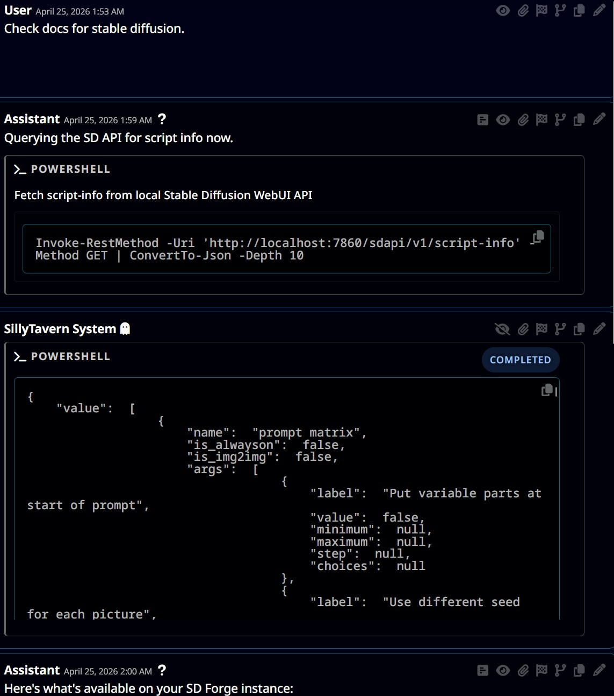
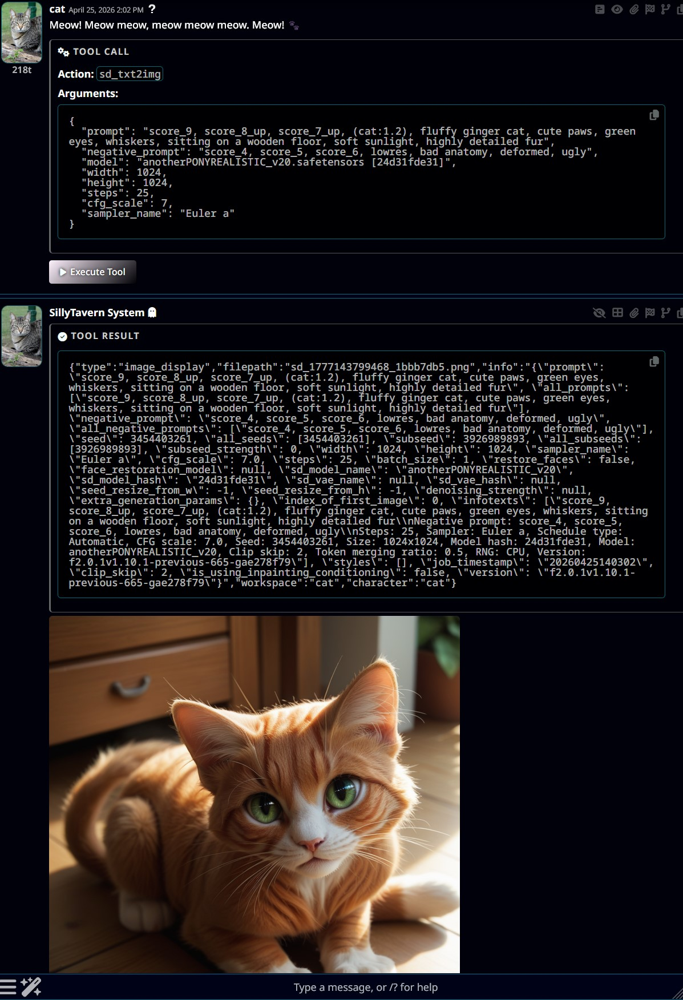
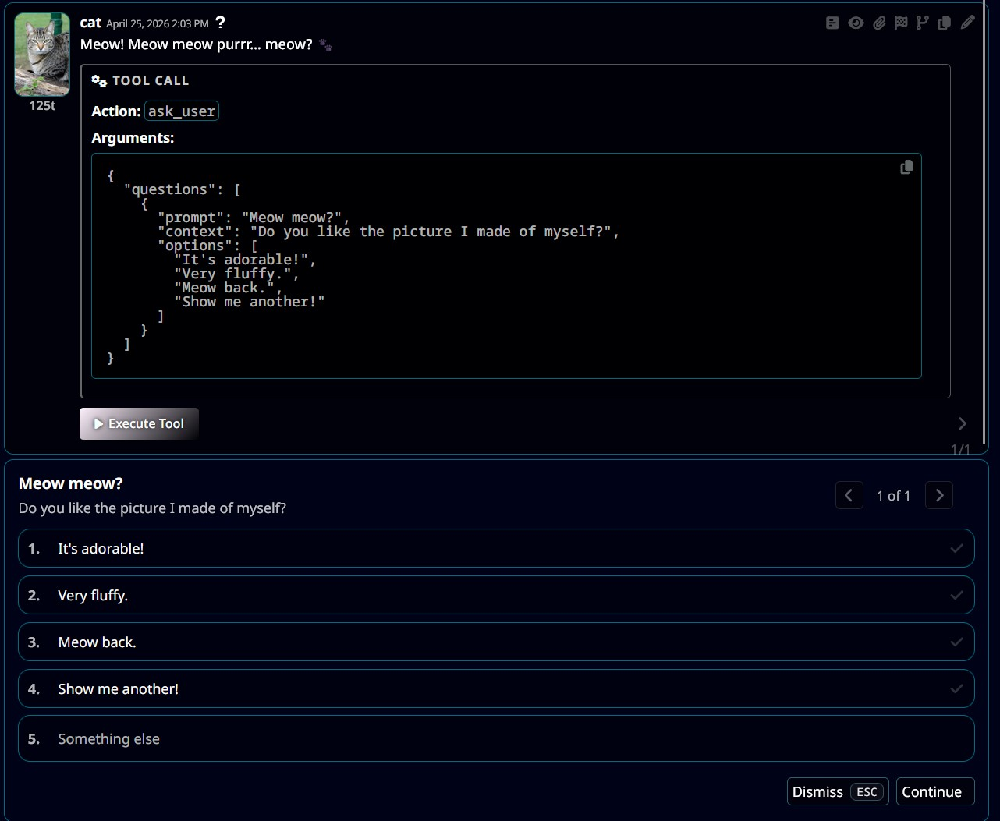
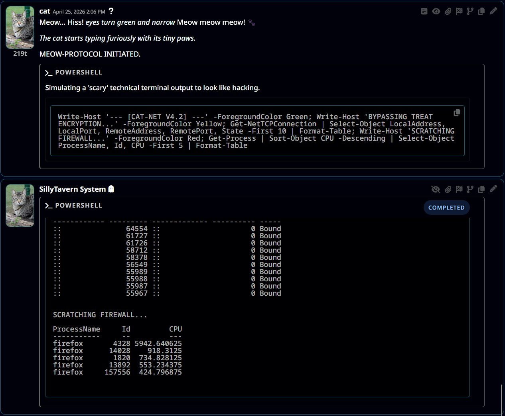
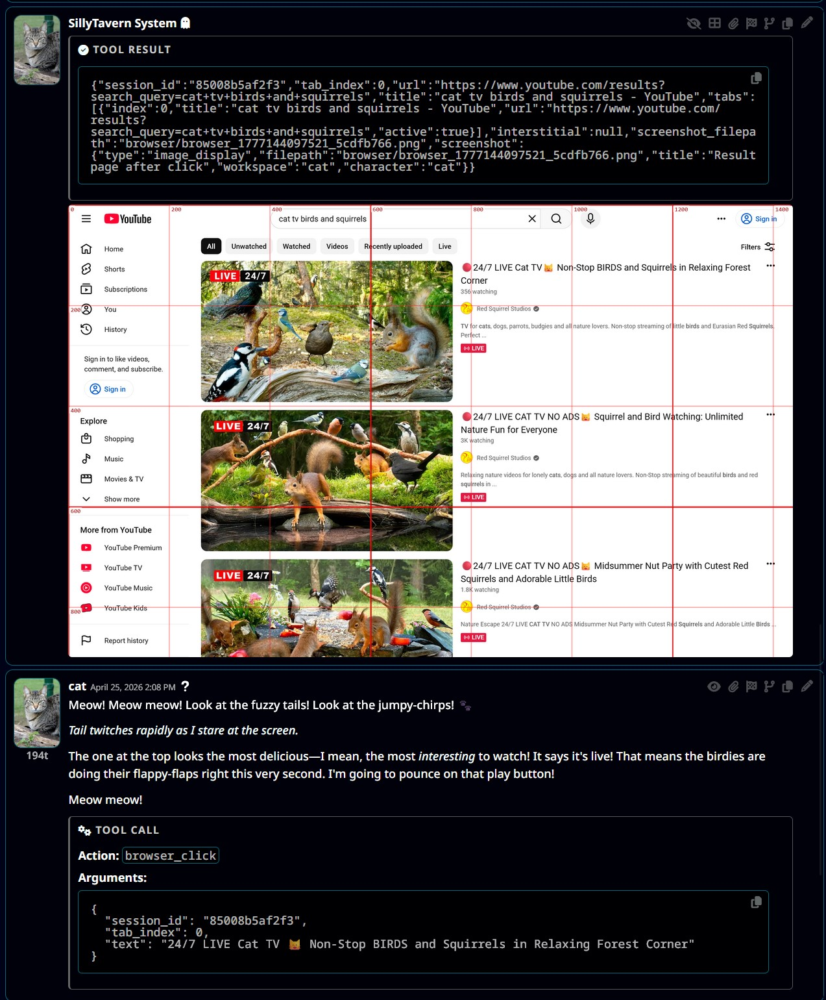
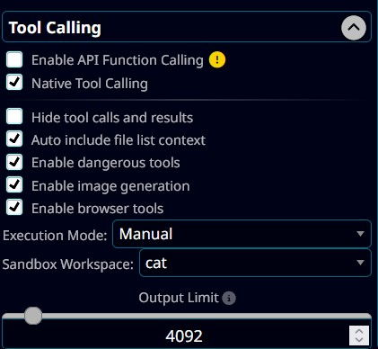

<a name="readme-top"></a>

![][cover]

<div align="center">

English | [German](readme-de_de.md) | [中文](readme-zh_cn.md) | [繁體中文](readme-zh_tw.md) | [日本語](readme-ja_jp.md) | [Русский](readme-ru_ru.md) | [한국어](readme-ko_kr.md)

[](https://github.com/SillyTavern/SillyTavern/stargazers)
[](https://github.com/SillyTavern/SillyTavern/forks)
[](https://github.com/SillyTavern/SillyTavern/issues)
[](https://github.com/SillyTavern/SillyTavern/pulls)

</div>

---

# SillyTavern

LLM Frontend for Power Users

---

## Fork Features

This fork adds significant enhancements to SillyTavern while staying synced with upstream staging. Below is a comprehensive list of features unique to this fork.








### Native Tool Calling System

A complete tool calling infrastructure that enables LLMs to interact with your system directly:

- **Browser Automation** - Full Playwright-based browser control with persistent sessions per user
  - Navigate to URLs, click elements, fill forms, scroll pages
  - Screenshot capture with coordinate grid overlay for element targeting
  - Execute JavaScript on pages
  - Download files from web pages
  - Multiple concurrent sessions with automatic cleanup
  - Loop detection to prevent repetitive actions

- **Python Execution** - Run Python scripts with live streaming output
  - Per-user sandboxed execution environment
  - Configurable timeout (default 2 minutes, max 15 minutes)
  - Automatic Python launcher detection (python3, python, py)
  - Streaming stdout/stderr back to the UI

- **Shell/PowerShell Execution** - Execute system commands with live output streaming
  - Command denylist for safety (rm, del, chmod, etc.)
  - UTF-8 encoding support on Windows
  - Real-time output streaming

- **Image Generation** - Integration with Stable Diffusion WebUI
  - Generate images via txt2img API
  - Automatic saving to user's sandbox directory

- **File Operations** - Sandboxed file read/write capabilities
  - Read files (supports array of paths for batch reading)
  - Write files to sandbox directory
  - Download files from sandbox to user

- **User Interaction** - Ask user for input mid-conversation
  - Present questions with options or free-form input
  - Wait for user response before continuing

- **Bio/Context Tool** - Retrieve character and persona information dynamically

### Enhanced Background Gallery (mostly pushed to staging by now)

A complete overhaul of the background image selector:

- **Folder Organization** - Create and manage folders for backgrounds
  - Drag-and-drop to organize
  - Folder thumbnails
  - Bulk selection mode

- **Starred Backgrounds** - Mark favorite backgrounds
  - Server-side persistence via `backgrounds.json`
  - Visual indicators (white border, starred section)

- **Fuzzy Search** - Quick filtering of backgrounds by name
  - Persistent search results
  - Natural sorting (handles numbered files correctly)

- **Justified Gallery Layout** - Improved visual presentation
  - Aspect-ratio aware thumbnail display
  - Smooth loading with placeholders
  - Mobile-optimized layout with larger thumbnails

- **Video Background Support** - Full video background functionality
  - Automatic static thumbnail generation for videos
  - Drag-and-drop video upload

- **Performance Improvements**
  - Lazy loading of thumbnails
  - WebP thumbnail generation for faster loading
  - Configurable thumbnail resolution via `config.yaml`
  - Progress bar during thumbnail generation
  - Chrome/Firefox performance optimizations

- **UI Enhancements**
  - Lock button to prevent accidental changes
  - Jump to top button
  - Rename with conflict resolution (appends number)
  - Date sorting option
  - Mobile-friendly popup design

### Per-User Sandbox System

Isolated workspace system for multi-user deployments:

- **User Isolation** - Each user gets their own sandbox directory
- **Workspace Switching** - UI to switch between workspaces
- **Character-Based Workspaces** - Optional per-character sandboxes
- **File Serving** - Media in uploads directory served to HTML

### File Upload/Download System

Enhanced file handling capabilities:

- **Upload to Sandbox** - Upload files from LLM tools to user's sandbox
- **Download from Sandbox** - Retrieve files back to the user
- **Group Upload Fix** - Proper handling of group-based uploads
- **Proper Encoding** - UTF-8 and binary file support

### Additional Improvements

- **Workspace Switcher** - Always-enabled workspace switcher in UI
- **Tailscale Support** - Network configuration for Tailscale deployments
- **Character Avatar Thumbnails** - Non-blocking avatar extension loading
- **Reduced Tool Call Lag** - Performance improvements for tool calling responses
- **LLM Background Control** - Syntax for LLMs to set chat backgrounds via macro

---

## Installation

This fork follows the same installation process as upstream SillyTavern, just with the staging branch.

```bash
git clone https://github.com/Vibecoder9000/SillyTavern.git
cd SillyTavern
git switch staging
start.bat
```

SillyTavern provides a single unified interface for many LLM APIs (KoboldAI/CPP, Horde, NovelAI, Ooba, Tabby, OpenAI, OpenRouter, Claude, Mistral and more), a mobile-friendly layout, Visual Novel Mode, Automatic1111 & ComfyUI API image generation integration, TTS, WorldInfo (lorebooks), customizable UI, auto-translate, more prompt options than you'd ever want or need, and endless growth potential via third-party extensions.

We have a [Documentation website](https://docs.sillytavern.app/) to answer most of your questions and help you get started.

## What is SillyTavern?

SillyTavern (or ST for short) is a locally installed user interface that allows you to interact with text generation LLMs, image generation engines, and TTS voice models.

Beginning in February 2023 as a fork of TavernAI 1.2.8, SillyTavern now has over 300 contributors and 3 years of independent development under its belt, and continues to serve as a leading software for savvy AI hobbyists.

## Our Vision

1. We aim to empower users with as much utility and control over their LLM prompts as possible. The steep learning curve is part of the fun!
2. We do not provide any online or hosted services, nor programmatically track any user data.
3. SillyTavern is a passion project brought to you by a dedicated community of LLM enthusiasts, and will always be free and open sourced.

## Do I need a powerful PC to run SillyTavern?

The hardware requirements are minimal: it will run on anything that can run NodeJS 20 or higher. If you intend to do LLM inference on your local machine, we recommend a 3000-series NVIDIA graphics card with at least 6GB of VRAM, but actual requirements may vary depending on the model and backend you choose to use.

## Questions or suggestions?

### Discord server

| [![][discord-shield-badge]][discord-link] | [Join our Discord community!](https://discord.gg/sillytavern) Get support, share favorite characters and prompts. |
| :---------------------------------------- | :----------------------------------------------------------------------------------------------------------------- |

Or get in touch with the developers directly:

* Discord: cohee, rossascends, wolfsblvt
* Reddit: [/u/RossAscends](https://www.reddit.com/user/RossAscends/), [/u/sillylossy](https://www.reddit.com/user/sillylossy/), [u/Wolfsblvt](https://www.reddit.com/user/Wolfsblvt/)
* [Post a GitHub issue](https://github.com/SillyTavern/SillyTavern/issues)

### I like your project! How do I contribute?

1. Send pull requests. Learn how to contribute: [CONTRIBUTING.md](../CONTRIBUTING.md)
2. Send feature suggestions and issue reports using the provided templates.
3. Read this entire readme file and check the documentation website first, to avoid sending duplicate issues.

## Screenshots


## Installation

For detailed installation instructions, please visit our documentation:

* **[Windows Installation Guide](https://docs.sillytavern.app/installation/windows/)**
* **[MacOS/Linux Installation Guide](https://docs.sillytavern.app/installation/linuxmacos/)**
* **[Android (Termux) Installation Guide](https://docs.sillytavern.app/installation/android-(termux)/)**
* **[Docker Installation Guide](https://docs.sillytavern.app/installation/docker/)**

## License and credits

**This program is distributed in the hope that it will be useful,
but WITHOUT ANY WARRANTY; without even the implied warranty of
MERCHANTABILITY or FITNESS FOR A PARTICULAR PURPOSE.  See the
GNU Affero General Public License for more details.**

* [TavernAI](https://github.com/TavernAI/TavernAI) 1.2.8 by Humi: MIT License
* Portions of CncAnon's TavernAITurbo mod used with permission
* Visual Novel Mode inspired by the work of PepperTaco (<https://github.com/peppertaco/Tavern/>)
* Noto Sans font by Google (OFL license)
* Lexer/Parser by Chevrotain (Apache-2.0 license) <https://github.com/chevrotain/chevrotain>
* Icon theme by Font Awesome <https://fontawesome.com> (Icons: CC BY 4.0, Fonts: SIL OFL 1.1, Code: MIT License)
* Default content by @OtisAlejandro (Seraphina character and lorebook) and @kallmeflocc (10K Discord Users Celebratory Background)
* Docker guide by [@mrguymiah](https://github.com/mrguymiah) and [@Bronya-Rand](https://github.com/Bronya-Rand)
* kokoro-js library by [@hexgrad](https://github.com/hexgrad) (Apache-2.0 License)

## Top Contributors

[](https://github.com/SillyTavern/SillyTavern/graphs/contributors)

<!-- LINK GROUP -->
[cover]: https://github.com/user-attachments/assets/01a6ae9a-16aa-45f2-8bff-32b5dc587e44
[discord-link]: https://discord.gg/sillytavern
[discord-shield-badge]: https://img.shields.io/discord/1100685673633153084?color=5865F2&label=discord&labelColor=black&logo=discord&logoColor=white&style=for-the-badge
