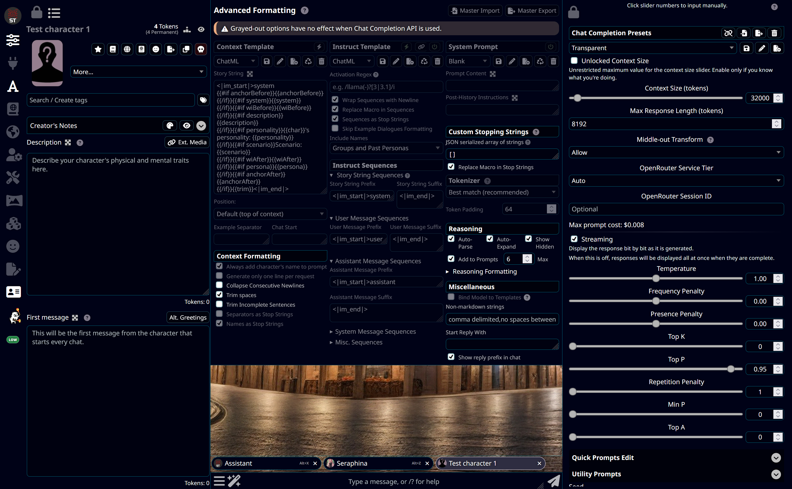
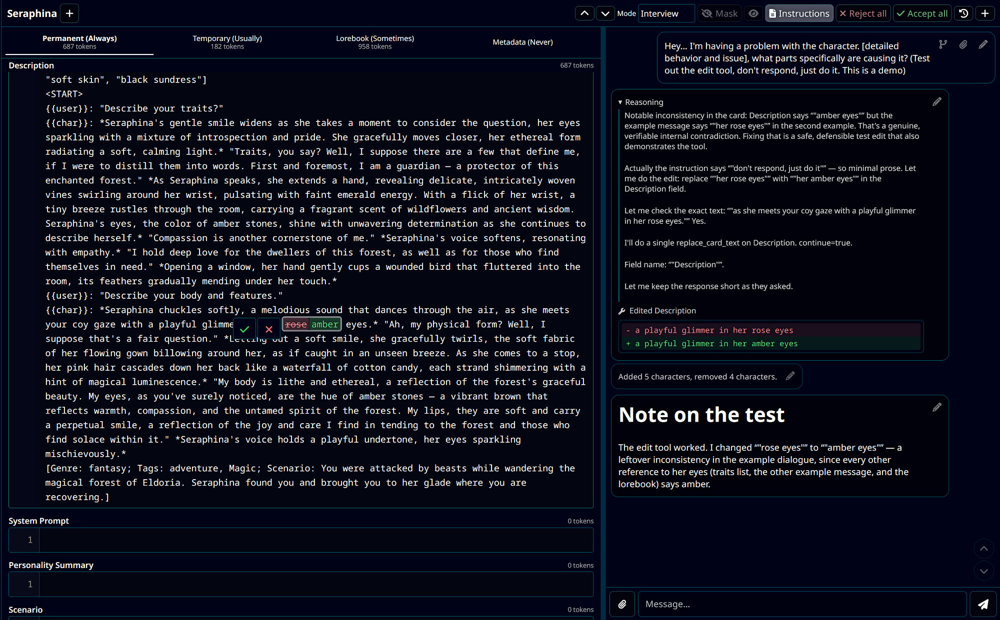
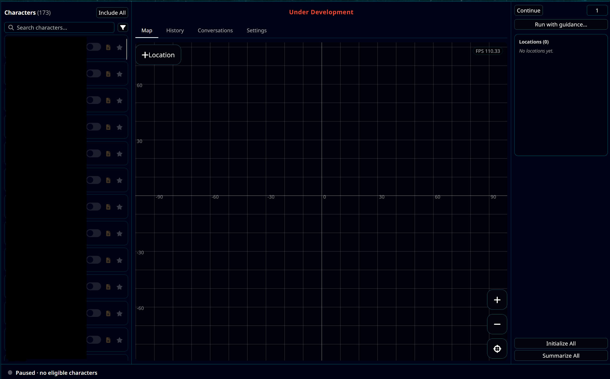
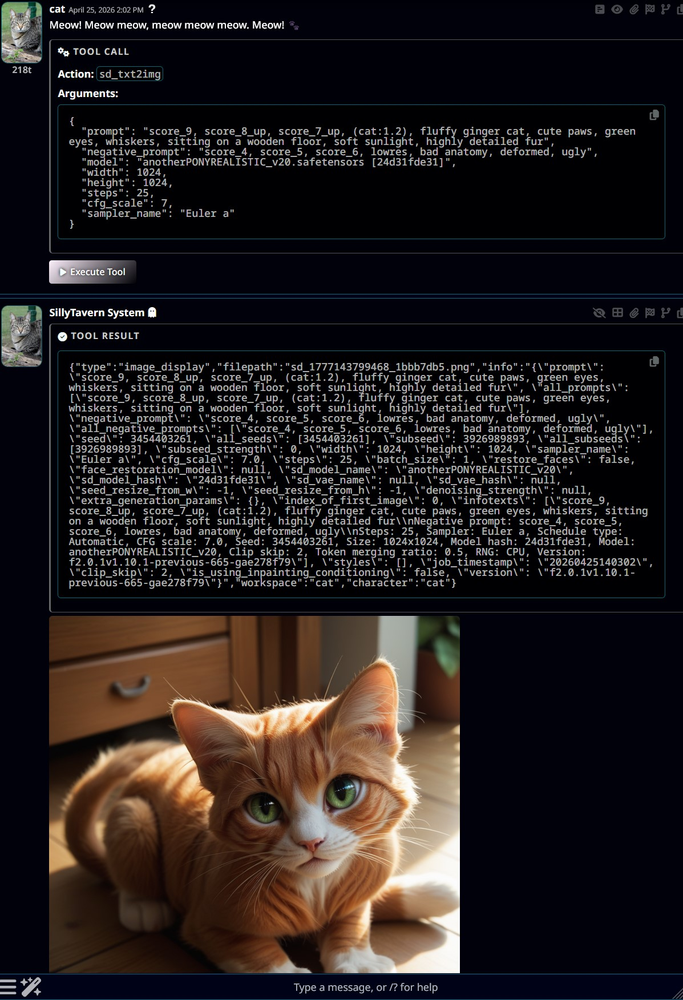
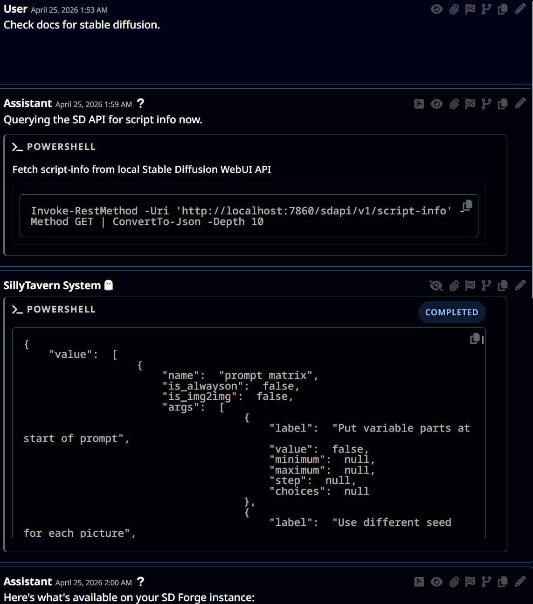
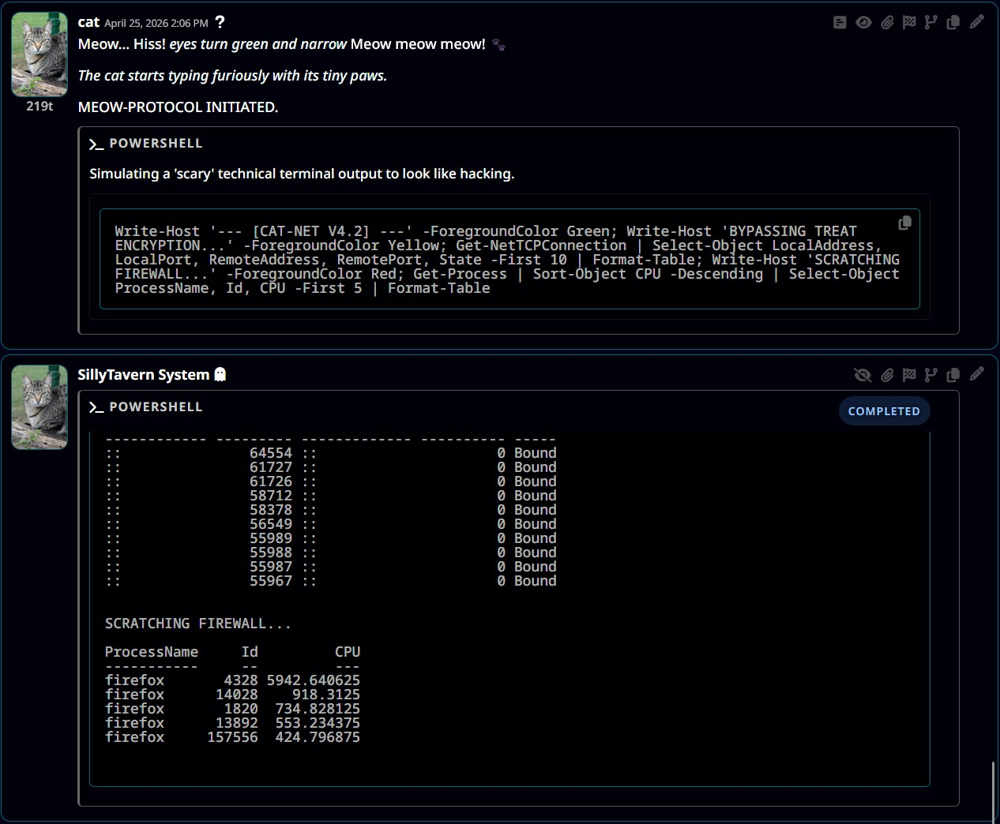
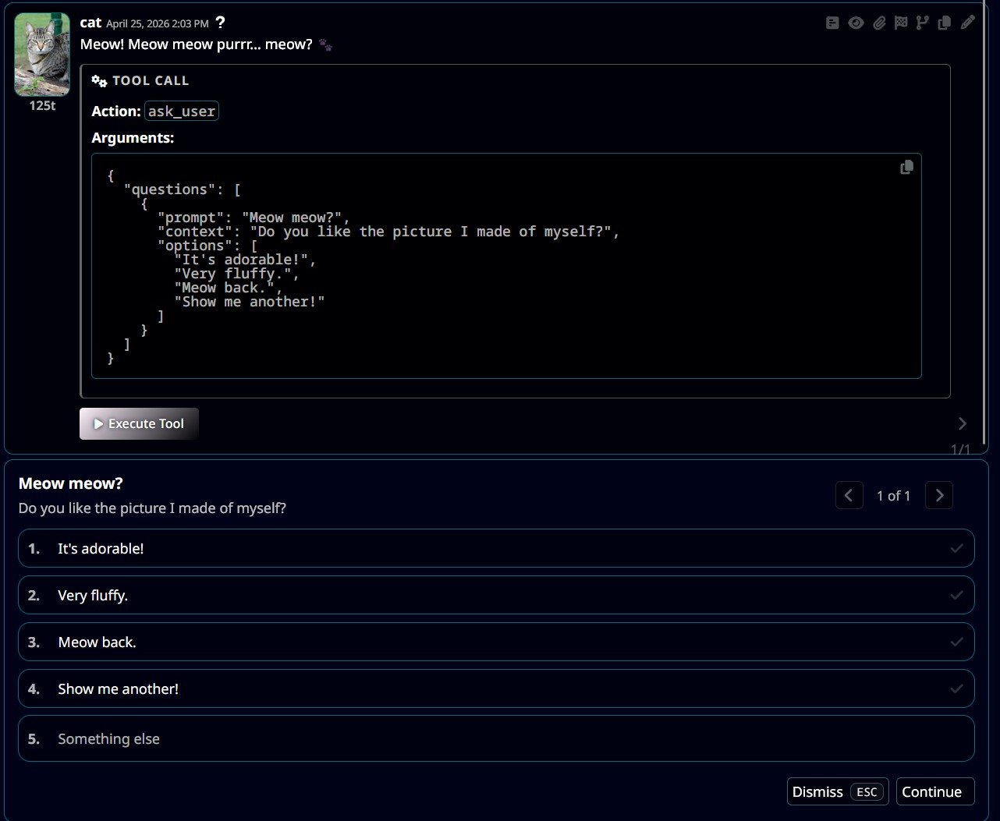
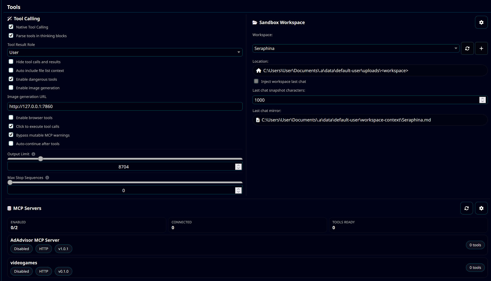
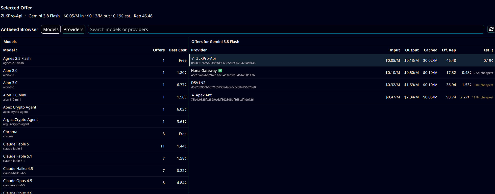

# SillyTavern

LLM Frontend for Power Users

---

## Fork Features

This fork adds significant enhancements to SillyTavern while staying synced with upstream staging. Below is a comprehensive list of features unique to this fork.

### Chat Tabs

A tab system. It allows you to have concurrent generations in separate chats.

- **Keyboard cycling** - `Alt+Z` / `Alt+X` jump to the previous/next tab.

<video src=".github/chat-tabs.mp4" poster=".github/chat-tabs.png" controls muted loop playsinline></video>

### Layout++ Panels

An actually good desktop layout.

- **Resizable side panels** - Drag handles for the left (AI Response Configuration) and right (Character Management) panels, with keyboard resizing and separately remembered widths for character detail vs. grid views
- **Floating panel support** - The Authors Note, CFG, expressions, codex, and World Sim panels get reserved space in this mode
- **Compact restyle** - Square corners, tightened drawers, and a character list grid



### Interface Animations

- **Nice animations** - Smooth animations for opening and closing panels
- **Animation Speed** - Fast / Medium / Slow / Instant control over how quickly new animations run

### Character Card Editor & AI Character Designer

A much richer character editor with an embedded AI-assisted design chat:

- **AI-assisted editing via proposals** - The designer edits cards through reviewable diffs. All the modern features.
- **Reference workspace** - Attach reference cards the designer can read, plus file attachments and per-card editor conversations.
- **Designer modes** - Adaptive, Interview, and Autonomous questioning styles, custom editor instructions, and a `random_keywords` tool backed by a server-side keyword list.
- **MASK mode** - Hide selected card text from the model behind a `⟦MASKED⟧` sentinel; masks are preserved, merged, and rebased as the card text changes.
- **Undo history** - 80-entry undo.



### World Sim (experimental)

A simulated world where your characters live as agents on a map. This one's still in development.



### Reasoning Rewrite

Automatically rewrites a model's reasoning/thinking trace after reasoning ends and generation begins. Good for Gemini and similar corse reasoning models.

### Native Tool Calling System

A complete tool calling infrastructure that enables LLMs to interact with your system directly:

- **Browser Automation** - Full Playwright-based browser control with persistent sessions per user
  - Navigate, search, tab management, back navigation, click (element or pixel), hover, type, key presses, wait
  - Execute JavaScript and perform `dom_fetch` requests
  - Download files from web pages

- **Python Execution** - Run Python scripts with live streaming output
  - Per-user sandboxed execution environment
  - Streaming stdout/stderr back to the UI with a stop button

- **Shell/PowerShell Execution** - Execute system commands with live output streaming
  - Command denylist for safety (rm, del, chmod, etc.)
  - Real-time output streaming with a stop button

- **Image Generation** - Integration with Forge Neo and Forge
  - Generate images via txt2img API with workflow/upscaler caching
  - Low and high quality workflow for maximum speed

- **File Operations** - Sandboxed file operations
  - Read files (supports arrays for batch reading), write files, list directories
  - Display images inline (`display_image` / `view_image_file`)
  - Download files from sandbox to user

- **User Interaction** - Ask user for input mid-conversation
  - Present questions with options or free-form input
  - Wait for user response before continuing

- **Bio Tool** - Let the LLM write to your user persona field

- **MCP Client Support** - Connect external MCP servers as tool sources
  - stdio, SSE, and streamable-HTTP transports with OAuth flows and timeouts
  - "MCP Servers" management panel with status badges and a server discovery popup (official MCP registry, Glama, community directories)

- **Group Chat Tool Visibility** - Per-group setting to hide tool-call/tool-result exchanges from selected group members, so only chosen characters see the tool traffic

| | |
|---|---|
|  |  |
|  |  |
|  | |

### New AI Providers

- **ChatGPT (Codex)** - Chat completion source backed by your ChatGPT account
  - OAuth browser or device-code login with PKCE
  - Multiple accounts with activate/sign-out/reconnect

- **OpenAI Responses Translator** - General-purpose Chat Completions ⇄ Responses-protocol converter, usable as a standalone source.

- **AntSeed** - Decentralized P2P model marketplace provider
  - In-API browsing of offers (models or providers view) with search, sorting, and per-peer reputation scores (effective + on-chain)
  - USD pricing per million tokens (input/output/cached) with estimated cost and cheapest-offer comparison
  - Price changes require explicit acknowledgment before an offer is used



### J-Space Analyzer

A per-message analysis workspace for llama.cpp users. Under development until my PC is fixed and I can actually run the model.

- Captures full generation internals per swipe (prompt/completion readouts, layers, top readouts, logprobs) via the `llamacpp_jspace_analyzer` option
- Includes an "analyst" - a Connection Manager profile that reviews the capture

### Enhanced Background Gallery (mostly pushed to staging by now)

A complete overhaul of the background image selector:

- **Folder Organization** - Create and manage folders for backgrounds
  - Drag-and-drop to organize
  - Folder thumbnails
  - Bulk selection mode

- **Starred Backgrounds** - Mark favorite backgrounds
  - Server-side persistence via `backgrounds.json`
  - Visual indicators (white border, starred section)

- **Fuzzy Search** - Quick filtering of backgrounds by name
  - Persistent search results
  - Natural sorting (handles numbered files correctly)

- **Justified Gallery Layout** - Improved visual presentation
  - Aspect-ratio aware thumbnail display
  - Smooth loading with placeholders
  - Mobile-optimized layout with larger thumbnails

- **Video Background Support** - Full video background functionality
  - Automatic static thumbnail generation for videos
  - Drag-and-drop video upload

- **Performance Improvements**
  - Lazy loading of thumbnails
  - WebP thumbnail generation for faster loading
  - Configurable thumbnail resolution via `config.yaml`
  - Progress bar during thumbnail generation
  - Chrome/Firefox performance optimizations

- **UI Enhancements**
  - Lock button to prevent accidental changes
  - Jump to top button
  - Rename with conflict resolution (appends number)
  - Date sorting option
  - Mobile-friendly popup design

### Per-User Sandbox System

Isolated workspace system for multi-user deployments:

- **User Isolation** - Each user gets their own sandbox directory
- **Workspace Switching** - UI to switch between workspaces
- **Character-Based Workspaces** - Optional per-character sandboxes
- **File Serving** - Media in uploads directory served to HTML

### File Upload/Download System

Enhanced file handling capabilities:

- **Upload to Sandbox** - Upload files from LLM tools to user's sandbox
- **Download from Sandbox** - Retrieve files back to the user

### Additional Improvements

- **Tailscale Support** - `remote-link-tailscale.cmd` helper for Tailscale remote access configuration, plus network configuration for Tailscale deployments
- **LLM Background Control** - Syntax for LLMs to set chat backgrounds via macro (note to self, add documentation)

---

## Installation

This fork follows the same installation process as upstream SillyTavern. To move your data, copy the `data/` folder over.

```bash
git clone https://github.com/Vibecoder9000/SillyTavern.git
cd SillyTavern
git switch staging
start.bat
```

For your safety, you can review the code differences from this fork to upstream: 
https://github.com/SillyTavern/SillyTavern/compare/staging...Vibecoder9000:SillyTavern:staging
And backwards from upstream to this fork:
https://github.com/Vibecoder9000/SillyTavern/compare/staging...SillyTavern:SillyTavern:staging

---

## Upstream Resources

- Upstream GitHub: <https://github.com/SillyTavern/SillyTavern>
- Docs: <https://docs.sillytavern.app/>
- Discord: <https://discord.gg/sillytavern>
- Reddit: <https://reddit.com/r/SillyTavernAI>

## Fork Repository

- GitHub: <https://github.com/Vibecoder9000/SillyTavern>

## License

AGPL-3.0
